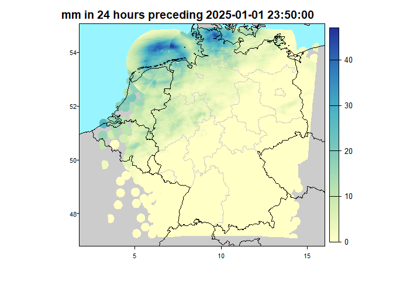

use case 2 - get rain distribution along the Elbe River
================

<!-- README.md is generated from README.Rmd. Please edit that file -->

# 1 Introduction

# 2 Install packages

``` r
#library(rdwd)
#rdwd::updateRdwd() # --> installes the last version, developement version on the github is used..
library(rdwd)

#install.packages('dwdradar')
library(dwdradar)
library(radolanr)

library(ggplot2)

library(tidyverse) 

library(reshape2)

library(terra) # for the raster and vector data treatment
```

# 3 load vector file to extract data

``` r
# read shapefiles of target areas
#my.centroids <- terra::vect("data_raw/transsect_weinbau_seusslitz_pillnitz_4326.shp")
```

## 3.1 DATENBESCHREIBUNG

–\> refer to UseCase1

## 3.2 Process data

Access the radolan data latest dataset. Plotting will be undergone
according to the rdwd package

``` r
radp <- radolanr::dataDWDPerDay(mode = "latest", addMetaData = TRUE)
```

# 4 extract values from raster file and save to given polygons

extract values at specific point with raster..

Todo: bisher stimmen diese Werte nicht mit denen überein die ich in der
App ausgebe –\> also mit denen die von <https:---recent> erstellt
werden. Die Daten auf dem opendata.dwd scheinen 1h aktueller als die
Daten auf dem cdc-ftpserver

``` r
transsect_rain <- radolanr::radolan2polygon(
  locations_polygon_path = "data_raw/transsect_weinbau_seusslitz_pillnitz_polygons_4326.shp",
  radolan_raster = radp, # radolan raster file
  saveCentroidsVector = FALSE
)
```

# 5 Plots

plot metadata stored along the raster (time of access and acutality of
the radolan data). They are added by radolanr() if
radolanr::dataDWDPerDay(mode = “latest”, addMetaData = TRUE)

``` r
metags(radp)
```

Plot Radolan data

``` r
plotRadar(radp, main=paste("mm in 24 hours preceding"), project=FALSE)
```

<!-- -->

# 6 Plot results using Leaflet

## 6.1 Changing legend based on the background, show values when overing over map

``` r
library(leaflet)
library(sf)            # For spatial data
library(terra)         # For raster handling
library(RColorBrewer)  # For color palettes


# Define a color palette for rain amounts (based on polygons by default)
pal_rain <- colorNumeric(palette = "YlGnBu", domain = transsect_rain$rain_mm)

# Define a color palette for radp (raster) values
pal_radp <- colorNumeric(palette = "YlGnBu", domain = values(radp), na.color = "transparent")

# set timestamp
radolan_timestamp <- transsect_rain[1]$timestamp_radolan

# Create the Leaflet map
p1 <- leaflet() %>%
  # Base Layers: OpenStreetMap and RADP Raster
  addTiles(group = "OpenStreetMap") %>%  # Default basemap

  addRasterImage(radp, colors = pal_radp, opacity = 0.7, group = "RADP Raster") %>%  # Raster layer
  
  
  # Polygon Layer with Popups on Hover
  addPolygons(
    stroke = TRUE,               # Borderlines
    color = "black",             # Borderline color
    opacity = 1,                 # Borderline transparency
    data = transsect_rain,       # Polygon layer
    weight = 1,                  # Line thickness
    smoothFactor = 0.3,          # Smooth the polygon borders
    fillOpacity = 0.8,           
    fillColor = ~pal_rain(rain_mm),  # Color based on rain_mm
    label = ~paste0("Rain: ", rain_mm, " mm"),  # Show value on hover
    highlight = highlightOptions(weight = 2, color = "red", fillOpacity = 0.9) # Highlight effect on hover
  ) %>%


  # Add Layer Control to Toggle between OpenStreetMap and RADP Raster
  addLayersControl(
    baseGroups = c("OpenStreetMap", "RADP Raster"),  # User can switch backgrounds
    overlayGroups = c("Polygons"),  # Polygons always visible
    options = layersControlOptions(collapsed = FALSE)
  ) %>%

  # Add Dynamic Legend (changes based on background)
  addLegend(
    pal = pal_rain, values = transsect_rain$rain_mm, opacity = 0.8,
    labFormat = labelFormat(big.mark = "'"),
    title = paste0("Regen<br>Summe 24h<br>(mm)<br>RADOLAN<br>",radolan_timestamp),
    group = "OpenStreetMap"  # Legend applies when OpenStreetMap is active
  ) %>%
  addLegend(
    pal = pal_radp, values = values(radp), opacity = 0.8,
    labFormat = labelFormat(big.mark = "'"),
    title = "Regen<br>Summe 24h<br>(mm)<br>RADOLAN (Raster)",
    group = "RADP Raster"  # Legend applies when RADP Raster is active
  )

# Show the map
p1
```

# 7 Export Data to be used e.g. in QGIS

``` r
# terra::writeRaster(radp, "radolan4326.TIFF")
# terra::writeVector(transsect_rain, "transsect_weinbau_seusslitz_pillnitz_polygons_rain24h_4326.shp", overwrite = TRUE)
```

# 8 Options: load shapefiles from a google-drive folder

# 9 Options: load shapefiles from QFieldCloud
