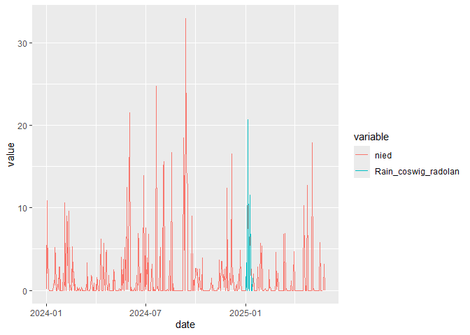
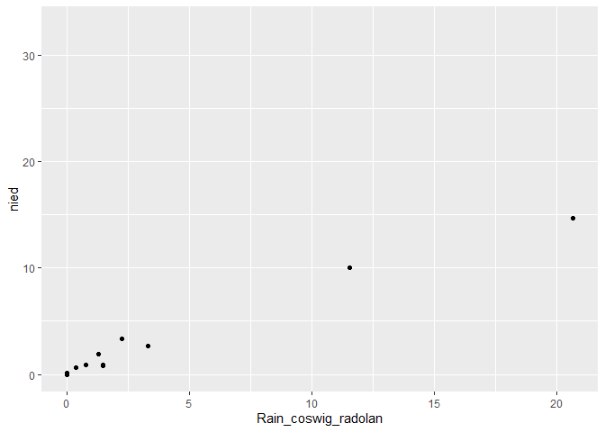

use case 1 - compare timeseries of Radolan and AMMS Station in Coswig
================

<!-- README.md is generated from README.Rmd. Please edit that file -->

# 1 Introduction

# 2 Install packages

``` r
# #library(rdwd)
# #rdwd::updateRdwd() # --> installes the last version, developement version on the github is used..
# library(rdwd)
# 
# #install.packages('dwdradar')
# library(dwdradar)
library(radolanr)

library(ggplot2)

library(tidyverse) 

library(reshape2)
```

# 3 load vector file to extract data

``` r
data(centroid_weatherstation)
# read shapefiles of target areas
#my.centroids <- terra::vect("data_raw/centroid_amms_weatherstation_coswig_4326.shp") # you may load it as a shapefile 
my.centroids <- centroid_weatherstation # or as an vector object
```

## 3.1 Test: Daily Radar Files

- refer to example in Berries Book:
  <https://bookdown.org/brry/rdwd/use-case-daily-radar-files.html>

rdwd::updateRdwd() Download and read with readDWD.radar with
dividebyten=TRUE:

- rdwd greift auf ftp server zu –\> umgucken dort mit winscp:
  opendata.dwd.de –\> anonym zugreifen
- ich greife mit meinem bisherigen skript auf https zu –\> das ist aber
  in dataDWD auch implementiert, also kann ich auch weiterhin auf die
  “latest” daten zugreifen
- so wie es scheint gibt es eine Abweichung um eine 10er Stelle. meine
  bisherigen Abfragen liefern höhere Werte um ziemlich genau \*10 höher
  –\> ich habe das Raster exportiert und die Werte verglichen am
  8.1.2024 9:22 nach Niederschlägen über nacht die bei ca. 2mm lagen??
  0.2 mm scheint mir zu wenig.
- auf opendata.dwd.de gibt es eine Erklärung im pdf Format zu den Daten
- <ftp://opendata.dwd.de/climate_environment/CDC/grids_germany/daily/>
  –\> hier gibt es auch evapotranspiratioen!!

## 3.2 DATENBESCHREIBUNG

- Räumliche Abdeckung: Deutschland
- Zeitliche Abdeckung: 2020-01-01 bis - heute
- Räumliche Auflösung: 1km x 1km
- Zeitliche Auflösung: 24 Stunden (rollend)
- Projektion: Polar Steoreographische Projektion, Zentral Meridian 10.0°
  O , Standard Parallele 60.0° N
- Format(e): Die Daten liegen als komprimierte Dateien im originären
  Binär-Format vor, Details siehe
  RADOLAN/RADVOR-Kompositformatbeschreibung.
- Parameter: **Niederschlagshöhe in 1/10 mm**
- Unsicherheiten: Eine erste Validierung der Daten zeigt, dass der
  mittlere absolute Fehler gegenüber den von Stationengemessenen Werten
  bei ca. 1,05 mm/Tag liegt. Details s. Beitrag zur Europäischen
  Radarkonferenz 2010 inSibiu.

Kommentar: Ich verstehe die Angabe, dass die Niederschlagshöhen in
1/10mm angegeben sind so, dass die tatsächliche Niederschlagshöhe durch
10 geteilt wurde und für die richtigen Niederschlagsmengen, \*10
gerechnet werden müssen! –\> wenn sich das bestätigt wäre ein Hinweis
für den Ersteller des Packages sehr hilfreich..

Eine Andere Erklärung ist, dass die werte in “Zehntel-Milimetern”
angegeben werden, dass also ein Wert von 1 einem Niederschag von 0.1mm
entspricht. Und ein Wert von 10 einem Niederschlag von 1 mm.

Todo: vergleiche Niederschläge einer Wetterstation in der Nähe mit den
Niederschlägen die von Radolan rausgegeben werden. Am Besten
Niederschlagsdaten einer Station und Radolandaten an dieser Station
vergleichen!

Datasets are available at hour:50 every hour. So the dataset at 23:50 is
the last dataset at a specific day

``` r
# dataDWDPerDay <- function(date = Sys.Date()-1, hour = "23"){
#   radbase <- paste0(gridbase,"/daily/radolan/recent/bin/") # gidbase = "ftp://opendata.dwd.de/climate_environment/CDC/grids_germany"
#   radfile <- format(date, paste0("raa01-sf_10000-%y%m%d",hour,"50-dwd---bin.gz"))
#   rad <- dataDWD(radfile, base=radbase, joinbf=TRUE)
#   radp <- projectRasterDWD(rad$dat)
#   radp <- radp * 10 # correct for the 1/10mm values to get mm (added Rikard, 8.1.2024)
#   return(radp)
# }

radp <- radolanr::dataDWDPerDay(date = Sys.Date()-1, hour = "23")
radp <- radolanr::dataDWDPerDay(mode = "latest")
```

Project and then plot: - there seem to be a problem with the decimal
places. One would understand 1/10mm, that a value of 1 means 0.1 mm but
if I compare the rain amounts with measured values by weather stations,
I would suggest, that a value of 1 is equal to 10mm of rain amount.

``` r
#plotRadar(radp, main=paste("mm in 24 hours preceding"), project=FALSE)
```

# 4 extract values from raster file

extract values at specific point with raster..

!! bisher stimmen diese Werte nicht mit denen überein die ich in der App
ausgebe –\> also mit denen die von <https:---recent> erstellt werden.
Die Daten auf dem opendata.dwd scheinen 1h aktueller als die Daten auf
dem cdc-ftpserver

``` r
# Extract raster values to list object
r.vals <- raster::extract(radp, my.centroids, na.rm = TRUE)  #
r.vals  
```

# 5 Extract rain values of several days for one place, maybe use map or just lists

``` r
days <- as.Date(as.Date("2025-01-01"):as.Date("2025-01-14"))
my_list <- vector("list", length = length(days))

# sequentially download radolan data for the last days
for (i in seq_along(my_list)){
  my_list[[i]] <- dataDWDPerDay(date = as.Date(days[i]), hour = "23")
}

# create raster stack
mystack <- terra::rast(my_list) # to create a raste stack use c(layer1, layer2,.. ) but if data is provided as a list use terra:rast(list)

# name the layers for easier referencing and for better naming after extraction
names(mystack) <- days

# extract the rain amounts at specific points
r.vals <- raster::extract(mystack, my.centroids, na.rm = TRUE)  #

rain_radolan <- as.data.frame(t(r.vals), ) # transpose the results
rain_radolan$date <- rownames(rain_radolan)
rain_radolan <- rain_radolan[-1,]
rownames(rain_radolan) <- NULL
colnames(rain_radolan) <- c("Rain_coswig_radolan","date" )


rain_radolan <- rain_radolan %>%
  mutate(date = as.Date(date)) %>%
  dplyr::select(date,Rain_coswig_radolan)

rain_radolan
```

# 6 use the package

``` r

library(rdwd)
library(dwdradar)
library(tidyverse)
radolanr::dataDWDPerDay()
radolan_stack <- radolanr::dataDWDPerDayInterval()
#my.centroids = terra::vect("data_raw/centroid_amms_weatherstation_coswig_4326.shp")
my.centroids <- centroid_weatherstation # or as an vector object --> here from radolanr::data(centroid_weatherstation)
my.timeseries <- radolanr::extractTimeSeriesFromStack(raster_stack = radolan_stack, centroids = my.centroids)
my.timeseries$time_series

raster_stack = radolan_stack
centroids = my.centroids
```

# 7 compare radolan data to measured data

``` r
#library(devtools)
#install_github("RikardGrass/opensensorwebr")
library(opensensorwebr)

library(lubridate) # lubridate for date transformations
# tidyverse for tidy data wrangling

my.startdate = "2024-01-01T00:00:00Z"
my.interval = as.numeric(Sys.Date() - as.Date(my.startdate)) * 24

#coswig <- opensensorwebr::etmodeldata("https://api.opensensorweb.de/v0/networks/AMMS_WETTERDATEN",
coswig <- opensensorwebr::etmodeldata("https://api.sensoto.io/v1/organizations/open/networks/AMMS_WETTERDATEN", # opensensorweb changed to sensoto
                                      my.device = "S021",
                                      my.startdate = my.startdate,
                                      my.interval = my.interval,
                                      ID.GlobRad = "Globalstrahlg_200cm",
                                      ID.AirTemp = "Lufttemp_200cm",
                                      ID.RH = "Luftfeuchtigkeit_200cm",
                                      ID.Rain = "Niederschlag",
                                      ID.Wind = "Windgeschw_250cm",
                                      file = "temp/Wetter_Coswig_",
                                      write.RData = FALSE,
                                      write.csv = FALSE)

#"https://api.sensoto.io/v1/organizations/open/networks/AMMS_WETTERDATEN/devices/S021/sensors/Globalstrahlg_200cm/measurements"


coswig_day <- coswig %>%
  mutate(date   = lubridate::date(date)) %>%
  group_by(date) %>%
  summarize(nied = sum(nied))
```

``` r
coswig_day  <- coswig_day %>%
  left_join(rain_radolan)

coswig_day_long <- coswig_day %>%
  reshape2::melt(., id.vars = c("date"))

ggplot(data = coswig_day_long, aes(y = value, x = date, colour = variable)) +
         geom_line()
```

<!-- -->

``` r

ggplot(data = coswig_day, aes(y = nied, x = Rain_coswig_radolan))+
  geom_point()
```

<!-- -->

``` r
summary(lm(nied ~ Rain_coswig_radolan, data = coswig_day))
```
